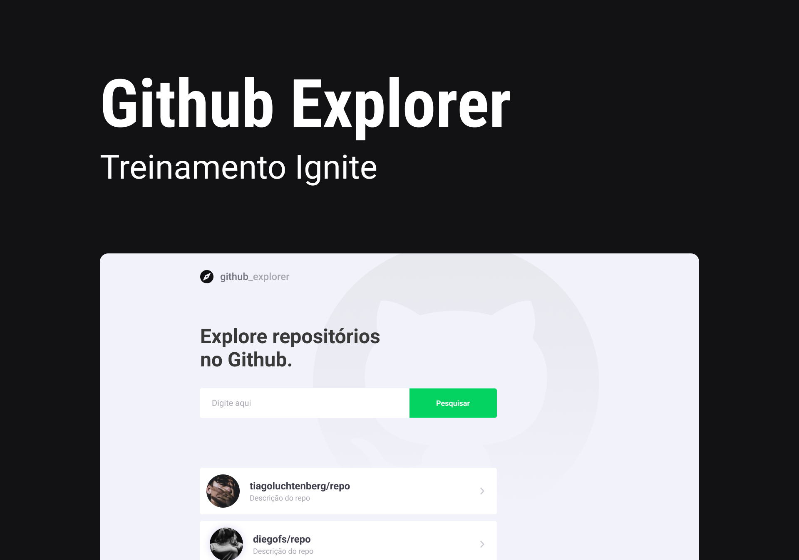

# Github Explorer

<div>
  
</div>

## 💻 Projeto

O projeto é um treinamento do Ignite - Trilha React (curso da Rocketseat). Nesse projeto foi construído uma aplicação para explorar repositórios do Github através da API Rest do próprio Github.

O projeto tem uma primeiro versão no treinamento, porém eu adaptei algumas funcionalidades para melhorias no projeto.

- Adicionado Axios;
- Typescript
- ContextAPI

## 🧪 Tecnologias

Esse projeto foi desenvolvido com as seguintes tecnologias:

- [Context API](https://pt-br.reactjs.org/docs/context.html);
- [GitHub API](https://docs.github.com/pt/rest);
- [ReactJS](https://pt-br.reactjs.org/);
- [SASS](https://sass-lang.com/);
- [Typescript](https://www.typescriptlang.org/).

## 🚀 Como executar

Clone o projeto e acesse a pasta do mesmo.

```bash
$ git clone https://github.com/sdc-jeferson/01-Ignite-Github-Explorer-Training.git

$ cd github-explorer.git
```

Para iniciá-lo, siga os passos abaixo:

```bash
# Instalar as dependências
$ yarn
# ou
$ npm install
```

```bash
# Iniciar o projeto
$ yarn dev
# ou
$ npm run dev
```

O app estará disponível no seu browser pelo endereço http://localhost:5173.

## 🔖 Layout

Você pode visualizar o layout do projeto através do link abaixo:

=> [Layout Web](https://www.figma.com/design/HOCmxfrElzLpI75LdzFLia/Github-Explorer?node-id=0-1&t=EadkKeJt0njdHZhW-0) (Lembrando que você precisa ter uma conta no Figma).
